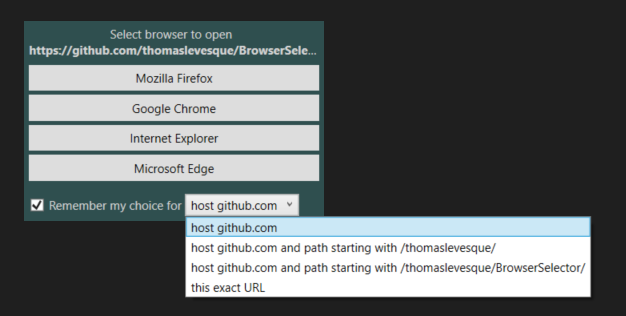

# BrowserSelector

> [!WARNING]
> This project is a work in progress and is not ready for use by the general public yet. Most importantly, there is:
> - No official release (you'll need to build it yourself)
> - No installer
> - No configuration UI
>
> Use at your own risk!

A simple tool to improve the experience when working with multiple browsers.
- Pick your browser of choice when opening a link.
- Remember your choice for the next time.
- Use a browser with a specific profile.

